# Peek-a-Boo Display   an ``_undefined_``[^1] display mount for Waveshare 4.3" DSI

> [!CAUTION]
> This mod is still under development,  the documention and files in the repo are still subject to contain errors.

> [!WARNING]
> **This mount needs 90mm free space behind the skirt. Make sure you have enough space so as not to collide with the electrical hardware**  

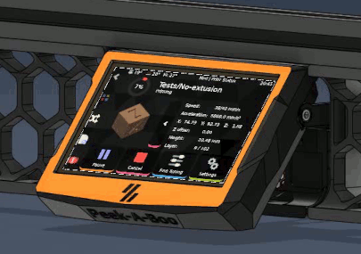  

## Bill of materials
| Hardware                        | Qty | Notes |
| ------------------------------- | --- | ----- |
| Waveshare 4.3" DSI QLED         | 1   | [Waveshare](https://www.waveshare.com/product/displays/lcd-oled/lcd-oled-2/4.3inch-dsi-qled.htm)
| DSI flat cable                  | 1   | length depends on Pi location
| M2x10 self tapping screw        | 2   |
| M3x8 SHCS                       | 11  |
| M3x10 SHCS                      | 8   |
| M3x12 SHCS                      | 4   |
| M3x16 SHCS                      | 2   |
| M3x20 SHCS                      | 2   |
| M3 square nuts                  | 2   | DIN562
| Heat insert M3x5x4              | 2   |
| 6x3 N52 magnet                  | 4   |
| Extension spring 5/16" x 1-1/8" | 1   | [amazon](https://www.amazon.fr/dp/B000K7M36W)                                                    
| Omron D2F-5L microswitch        | 1   | to wire to Pi Gpios
| RTV silicon                     |     | (Optional) to fix magnets
| ziptie 3mm                      | 3   | 

## Printed parts

All parts are designed to be printed with ABS, taking in account shrinkage. I you use  other materials (ABS+, ASA, ..) you will need to adjust your tolerances

> [!TIP] 
> The filenames prefixed ``\[fc\]`` for _filament change_. Print the 4 first layers with accent color then change to main color.   

For ABS turn off Hole and shrinkage compensation in your slicer.

The print settings are the same as Voron parts.

Most assemblies are done by screw-in-plastic. Your printed parts need to be accurate. First, print  _guide\_L.stl_ and _bracket\_L.stl_ to adjust your tolerance. Parts should slide smoothly, with not much play.

> [!WARNING]
> Check your parts before assembly, even slight warping is not acceptable.

## Assembly
### Frame assembly
- **STLs :** _\[frame_main, frame_spacer_x2, guide_L, guide_R\]_
- **Hardware :**  4 M3x10 SHCS

Mount guide on the frame, M3x10 are screwed in ABS, DO NOT OVERTIGTHEN, otherwise you will need to reprint. 

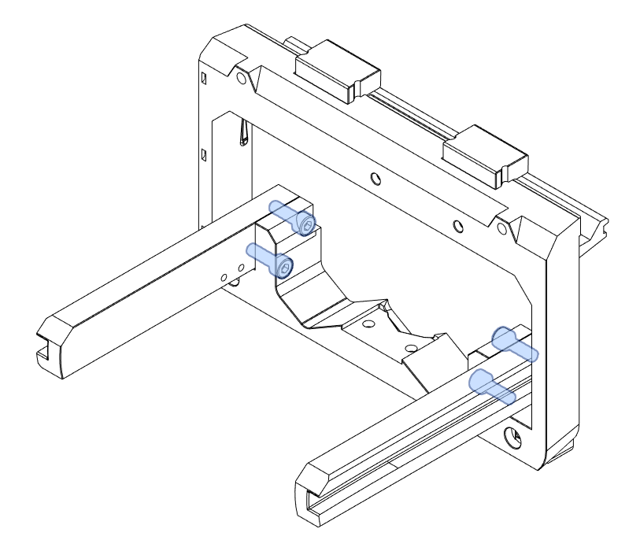

- **STLs :** _\[locker\]_
- **Hardware :** 4 M3x8, 2 M3x12 
  
Fix locker with 2 M3x8 and 2 M3x12
Insert 2 M3x8 in the frame, let about 2.5mm unscrewed, it will be used to fix the flat cable

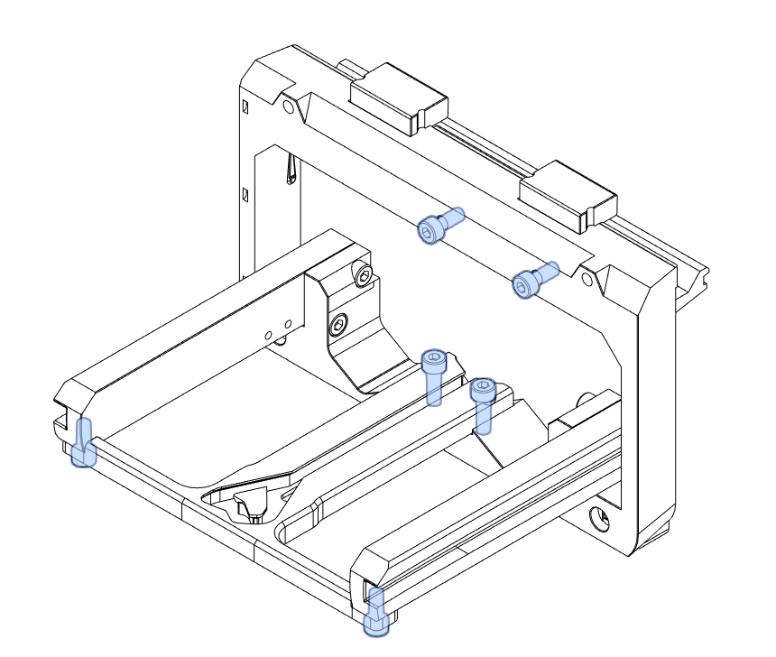

- **Hardware :** Microswitch D2F-5L, M2x10 selftapping screws

See [backlight controller](./scripts/README.md) for wiring.

- **Hardware :** 2 M3x20, 2 M3 T-nuts

Fix the frame assembly to the printer frame

### Tray assembly
- **STLs :** _\[bezel_back, bezel_front\]_
- **Hardware :** Waveshare 4.3" QLED DSI, DSI flat cable, 4 M2.5x5 screws, 4 M3x8 

Prepare the flat cable, you need to fold it twice.

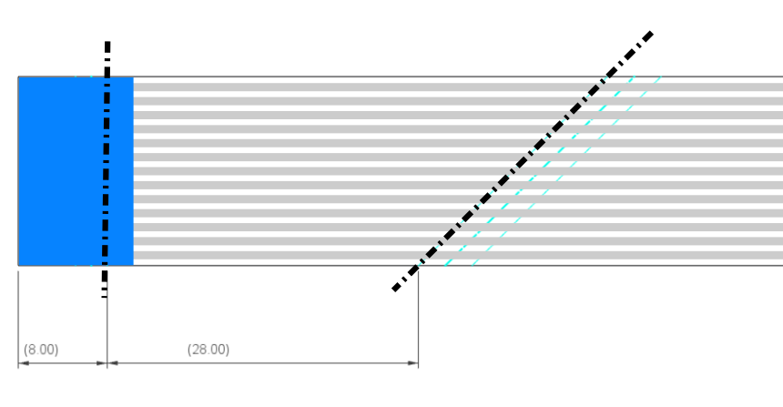

Insert the cable into the slot, route the flat cable into the _bezel_back_ screws it to the display, 

mount _bezel_front_ with M3x8

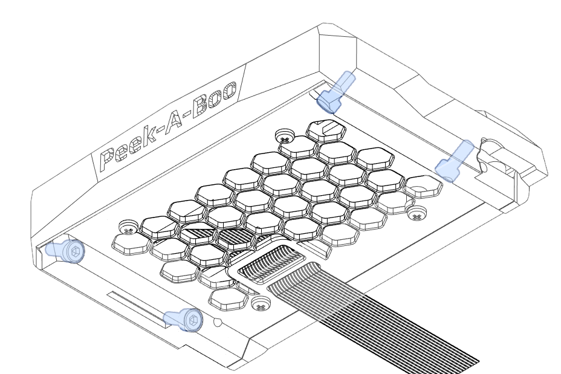

- **STLs :** _\[bracket_L, bracket_C, bracket_R, arm\]_
- **Hardware :** 2 N52 magnets, 2 M3x8, 2 M3x12, M3 Square nuts 

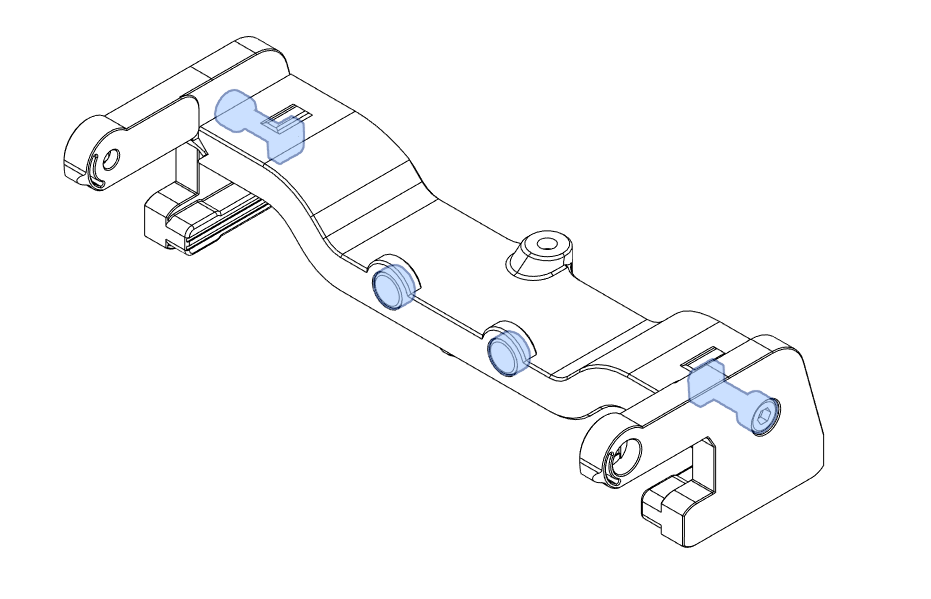
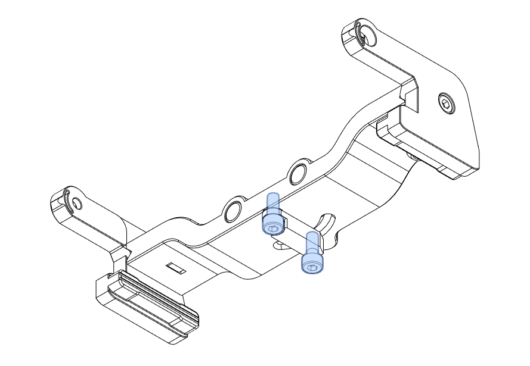

- **Hardware :** 2 M3x10

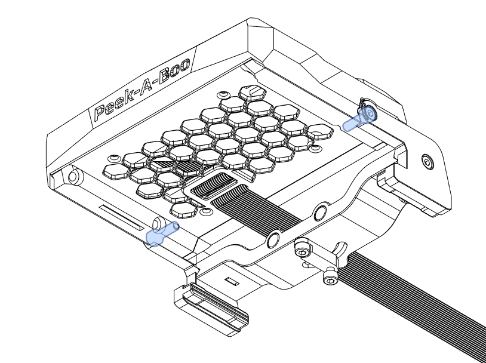

- **STLs :** _\[central_skirt\]_
- **Hardware :** 2 N52 magnets, 2 M3 heat inserts, 1 M3x10, 1 M3x8, 1 extension spring

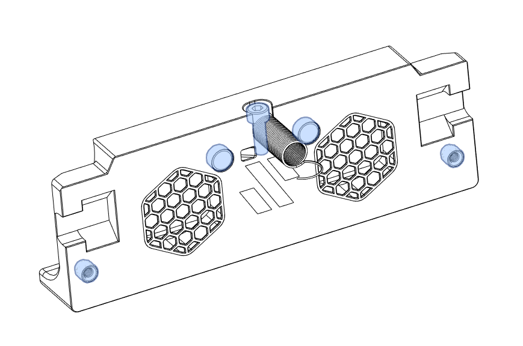
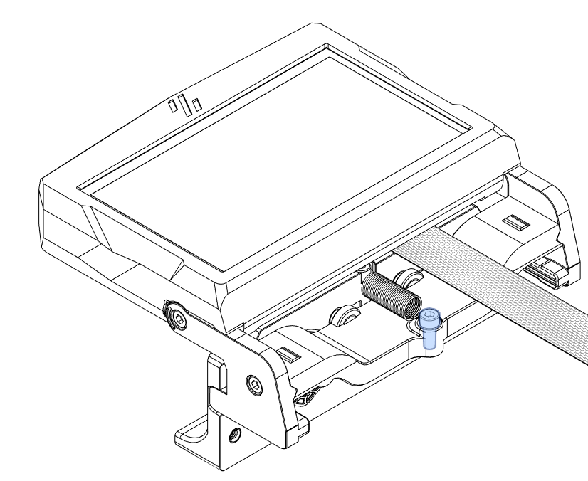

- **STLs :** _\[flat_cable\]_
- **Hardware :** 2 M3x16
  
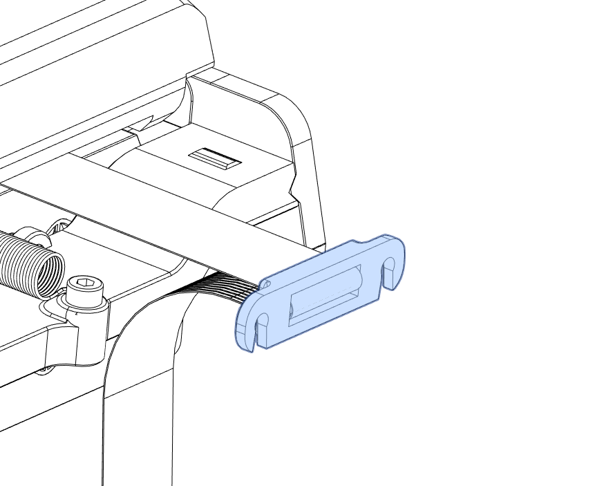

Put tray into frame assembly

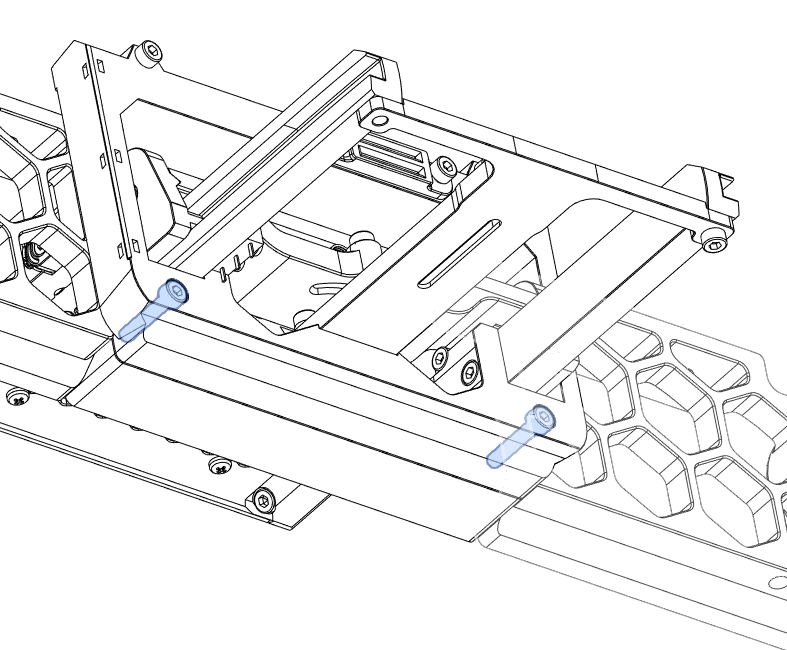
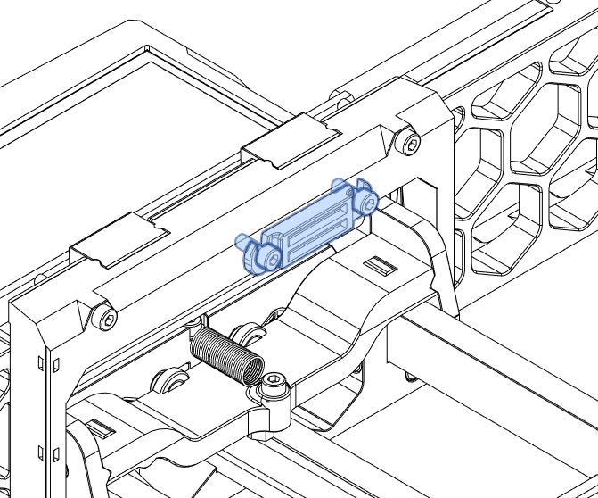

## Lubrication

... Todo ...

## Configuration of backlight Controller
 In order to turn on and off backlight, you need to install a service. See related [Readme.md](./scripts/)

## Aknowledgements
 Many thanks to the Voron team to let us express our modding skills. 
 Special thanks to the french Voron community.
 Thanks to @Falcon14141 for "Peek-a-boo", that's a great name for this one. 

[^1]: Thanks to #honhonhonbaguette, the Voron discord chan for the following proposals, without consensus all will remain pending :
    - @frenesik V2.3769 /ban_request
    - a pull-out display
    - a fold-away display
    - a retractable display
    - a FPC display ?
    - la réponse 5 (the fifth answer)
    - reserved to @elpopo V2.643.1047.3097 
    - a pop-up display
    - a sliding monitor shelf
    - Super Slider
    - Draw Where 
    - Where is my screen (WIMS)
    - Where is The Screen (WITS)
    - The Invisible Screen
    - Screen Nothing
    - Demande au Chat si GPT (ask to Chat if GPT : does not work in english)
    - most over-engineered and useless mod of ze France of ze world